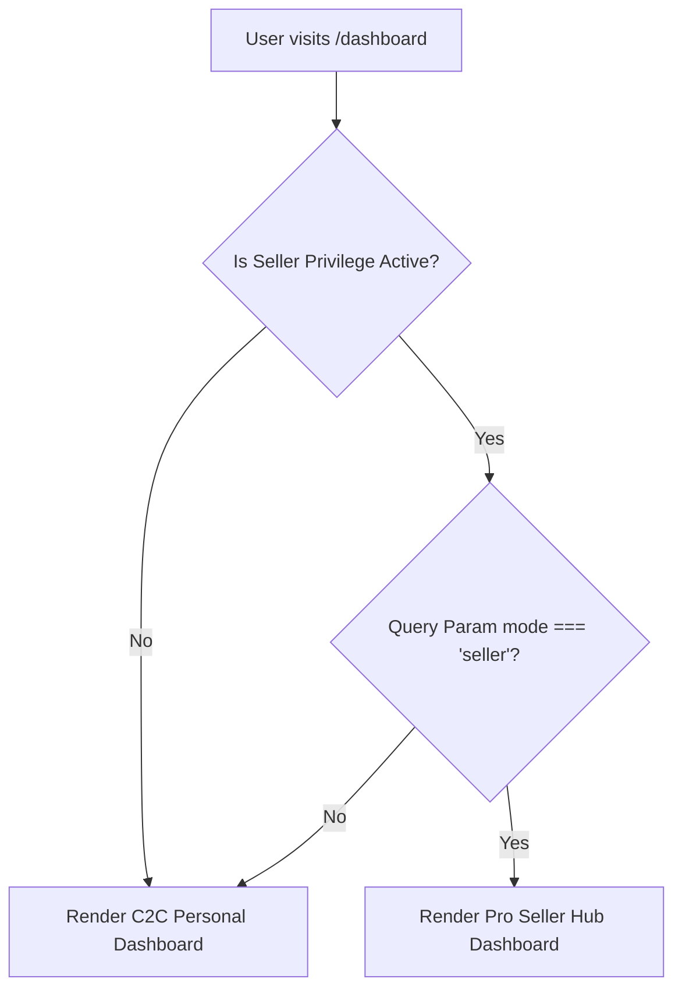

# Nilamit Developer Learning Guide (`LEARN.md`)

Welcome to the Nilamit technical learning documentation. This guide details the architecture, design choices, trust engine, and engineering lessons behind our C2C unified console.

---

## 1. Unified Dashboard Architecture (The "Switch Mode" Toggle)

### 🧩 Architectural Separation (Airbnb/Fiverr Design)
Historically, Nilamit utilized two separate routes for client-facing and business-facing consoles:
* `/dashboard` — Everyday consumer C2C panel.
* `/retailer/dashboard` — Pro merchant and verified store dashboard.

To elevate user experience, simplify routing, and eliminate duplicate layout states, we consolidated these into a **single, responsive route `/dashboard`**. Authorized verified merchants can seamlessly toggle modes on-the-fly using a premium switcher button:
* **Buyer View**: Dedicated to bidding alerts, watchlists, won items, and personal trust scores.
* **Seller View**: Dedicated to operations checkboards, ledger analytics, active listings, disputes, and synced bulk csv templates.



### 🔀 Redirect & Deprecation
To preserve backwards compatibility for old links, the route `/retailer/dashboard` has been deprecated and converted into an automated Next.js redirect:
```typescript
import { redirect } from "next/navigation";

export default function RetailerDashboardPage() {
  redirect("/dashboard?mode=seller");
}
```

---

## 2. Trust Engine & Database Purity

### 🌟 Rating Scale Conversion (0-5 Stars vs. 100% Feedback)
In Nilamit, reputation rating is stored in Firestore on a scale of `0.0` to `5.0` stars. When rendering professional feedback, we translate this into a standard positive feedback percentage:
```typescript
const hasReviews = seller.ratingCount > 0;
const feedbackPercentage = hasReviews && seller.rating
  ? Math.min(100, Math.round((seller.rating / 5) * 100))
  : null;
```

### 🟢 Dynamic Empty States for New Merchants
To comply with our database purity standards (no fake defaults or mock arrays), new sellers display an elegant, clean empty state rather than fabricated defaults:
* If review count is 0: Shows `"No feedback received yet"` (with slate-colored star) instead of fake review summaries.
* Volume is dynamically calculated directly from completed Firestore auction listings where `status === 'SOLD'`.

### 🛡️ Real-time Escrow Binding
Cards like **Awaiting Payment** and **Open Disputes** bind directly to actual Firestore escrow transaction collections where:
* `awaitingPayment`: Escrows in `PENDING` state.
* `openDisputes`: Escrows in `DISPUTED` state.
This provides verified stores with instantaneous, accurate operational context.

---

## 3. Key Engineering Lessons

### 1. Husky Pre-Commit Hook & ESLint Cleanliness
Husky automatically runs pre-commit hooks that trigger linter rules (`eslint --fix`). If lint errors exist, the commit will abort.
* **Avoid `any` Casts**: Strict linting bans `as any`. When parsing raw document data, cast to type-safe indexable structures instead:
  ```typescript
  // ❌ Fails pre-commit check:
  const rawEscrow = escrowSnap.data() as any;
  
  // ✅ Passes pre-commit check:
  const rawEscrow = escrowSnap.data() as { createdAt?: unknown; updatedAt?: unknown; [key: string]: unknown };
  ```
* **Escape Quotes in JSX**: In React/JSX, direct single quotes (`'`) cause unescaped entities validation failures. Always escape quotes cleanly:
  ```html
  <!-- ❌ Fails linter -->
  <p>Welcome to Bangladesh's Hub</p>
  
  <!-- ✅ Passes linter -->
  <p>Welcome to Bangladesh&apos;s Hub</p>
  ```

### 2. Verify Before Committing
To prevent commit rejects, always run verification commands locally:
* **Type-Check**: `npx tsc --noEmit`
* **Linter**: `npm run lint`
* **Unit Tests**: `npx vitest run`
