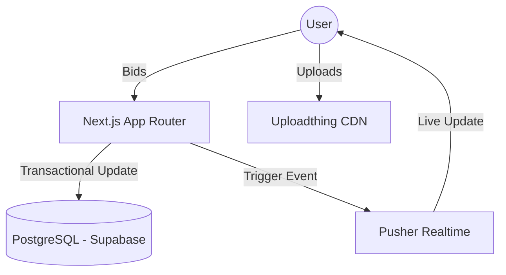

# 🏗️ Nilamit System Architecture

## Overview
Nilamit is a server-side pushed, real-time auction platform leveraging Next.js 15 and PostgreSQL.

## 1. High-Level Flow (Mermaid)

## 2. Core Components
### Bidding Engine (`src/actions/bid.ts`)
Uses **Prisma Transactions** with `SELECT FOR UPDATE` on the Auction table. This ensures that even with thousands of concurrent bidders, only one person can increment the price at a exact millisecond.

### Social Layer (`src/components/social`)
Built using a **Graph/Circle** model. Users belong to "Circles" which filter the `Auction` view. The **StarMap** component visualizes these connections.

### Worker Layer (`src/app/api/cron`)
Serverless functions that run every minute to:
- Close expired auctions.
- Pay out escrow sums.
- Generate reputation points for participants.

## 3. Data Model
- **User**: Identified by Phone (+880). Holds Reputation Score.
- **Auction**: Root entity. Closely tied to a `Seller`.
- **Bid**: Transaction log of all attempts.
- **Circle**: Logic for grouping auctions by community/location.

## 4. Security
- **Auth**: NextAuth with custom phone adapter.
- **API**: All data mutation is restricted to **Server Actions** to avoid exposing the database schema to the client.
- **DDoS**: Rate limiting on SMS and Bid actions via middleware.
## 5. Payment & Escrow (bKash Flow)
- **Escrow**: When an auction closes, the system marks the item as `SOLD`.
- **Payment**: The winner receives a payment link from the seller.
- **Verification**: Once confirmed via bKash/Nagad/Rocket sandbox, the system releases shipping info.
- **Commission**: A 10% platform fee is deducted/logged for later settlement.

## 6. Social Identity
- **StarMap**: Uses d3-force to simulate trust levels between nodes.
- **Circles**: Geofenced auction groups based on Bangaldesh administrative divisions.
