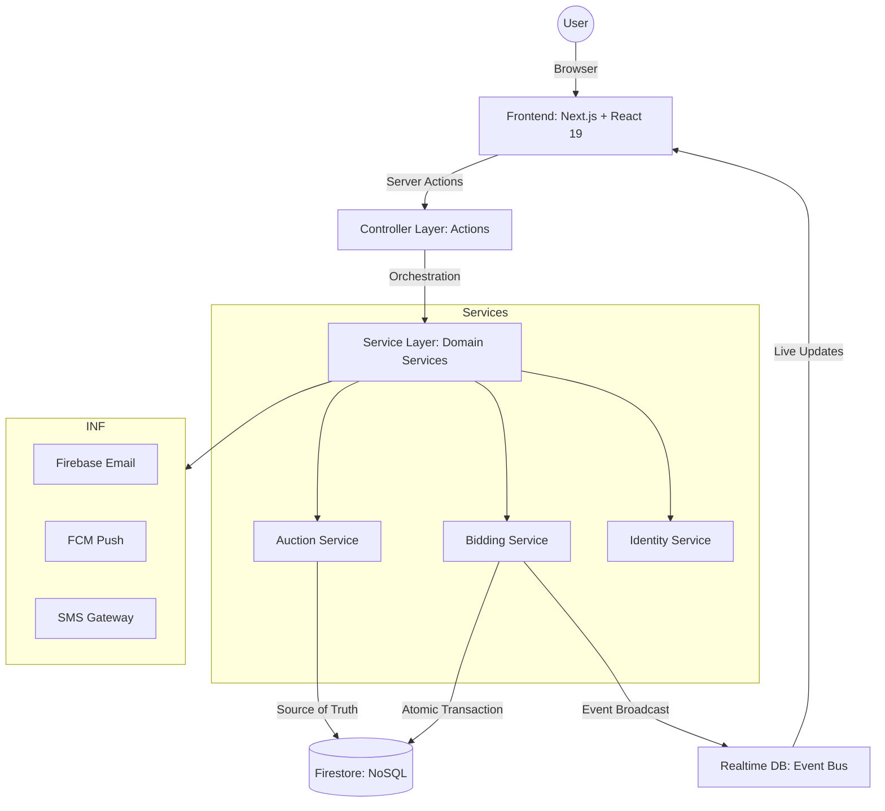

# Nilamit Architecture: The Firebase-Native SOA Blueprint (v2.0)

This document outlines the architectural layers and core technologies powering **Nilamit**, a mission-critical C2C auction marketplace built for scale.

## 🏛️ System Overview

Nilamit is built on a **Service-Oriented Architecture (SOA)** using Next.js 15 and the Firebase-Native stack. The architecture is designed for zero-latency bidding, atomic transactional integrity, and edge-level security.

---

## 🎨 Layer 1: Frontend (Next.js 15)
- **Framework**: React 19 + Next.js App Router.
- **Modularity**: Implements **Component Sharding** for complex interactive panels (e.g., `BidPanel`).
- **Performance**: Dynamic imports for heavy components and parallel data pre-fetching in Server Components.
- **Internationalization**: `next-intl` with `[locale]`-based dynamic routing (EN/BN).

## ⚙️ Layer 2: Controller (Server Actions)
- **Thin Controllers**: `src/actions` handle only high-level orchestration (Auth validation, revalidation, and error mapping).
- **Security Edge**: Implements **Upstash Rate Limiting** and **XSS Sanitization** before data reaches the services.

## ⚙️ Layer 3: Service Layer (Domain Logic)
- **Domain-Driven**: Core business logic is isolated in `src/services`.
- **Stateless & Scalable**: Logic is decoupled from the Next.js Request/Response cycle, allowing for high testability and reuse in CRON jobs or background workers.
- **Integrity**: Handles complex multi-step side effects like parallel notification triggers and gamification updates.

## 🗄️ Layer 4: Data (Firebase Native)
- **Firestore (Source of Truth)**: 
  - Stores all persistent state (Auctions, Bids, Users).
  - Uses **Administrative Transactions** for bidding to ensure absolute consistency.
  - Locked down with **Zero-Trust Security Rules** (No client-side writes).
- **Realtime Database (Event Bus)**: 
  - Handles high-frequency live state (Current Bid, Presence, Notifications).
  - Provides sub-100ms synchronization across all connected clients.

---

## 🔒 Security Architecture
- **Defensive Depth**: 3-tier validation (Action → Service → Database Rules).
- **Identity Normalization**: Case-insensitive admin guards and secure role derivation in NextAuth.
- **PII Shielding**: Automated regex-based filtering of sensitive info in public listings.
- **Rate Limiting**: Specialized limiters for Auth, Bids, and API calls to prevent automated abuse.

## 🚀 Performance Engineering
- **Query Parallelization**: Use of `Promise.all` for fetching metadata and paged data.
- **N+1 Resolution**: Batch-lookup patterns for linked records (e.g., bidders, sellers).
- **LCP Optimization**: Priority loading for ATF images and memoization of list items.

---

## 🏆 Reputation & Trust
- **Trust-Tier System**: Verification gates for phone numbers and MFS accounts.
- **Automated Moderation**: Middleware-level enforcement for banned users and atomic action blocking.
