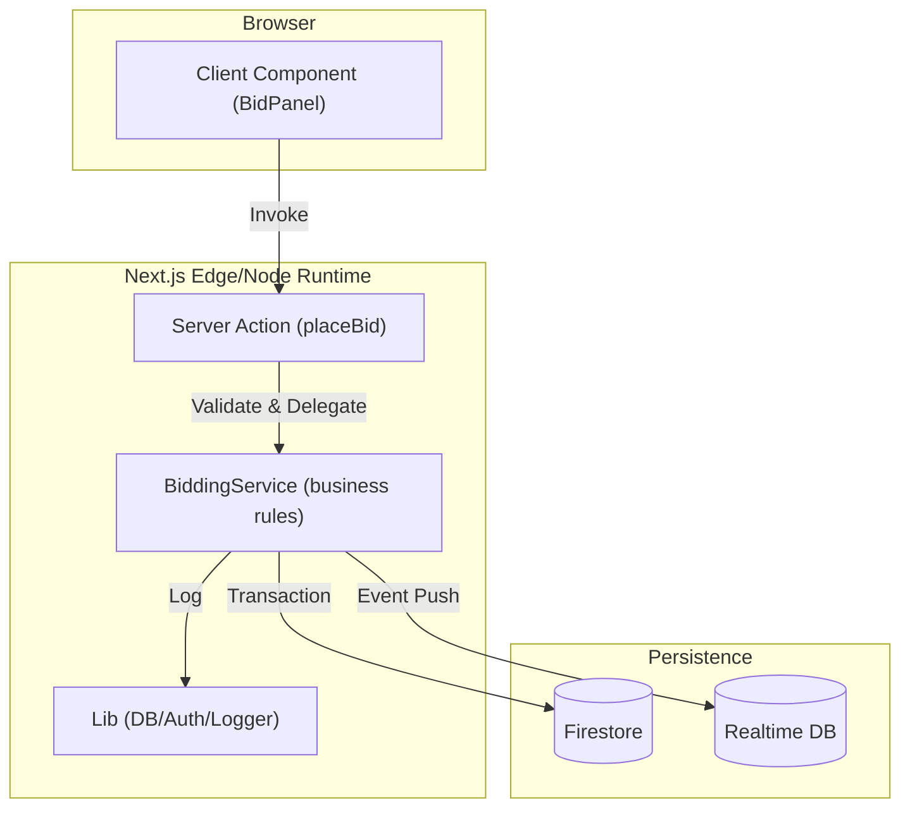

# Contributor Guide

Welcome to Nilamit! This guide will help you understand the architecture, domain model, and development workflow of Bangladesh's trusted auction marketplace.

## Part I: Foundations

Nilamit is built on a modern full-stack TypeScript stack. If you're coming from other ecosystems:

| Concept | Nilamit (Next.js/Firebase) | Comparison (e.g. Django/Rails) |
|---------|---------------------------|--------------------------------|
| **Controller** | [Server Actions](https://github.com/Sayem9999/nilamit.com/tree/main/src/actions) | Django Views / Rails Actions |
| **Business Logic** | [Services](https://github.com/Sayem9999/nilamit.com/tree/main/src/services) | Service Objects / Managers |
| **Data Layer** | [Firestore](https://github.com/Sayem9999/nilamit.com/blob/main/src/lib/db.ts) | ORM (ActiveRecord / Eloquent) |
| **Real-time** | [Firebase RTDB](https://github.com/Sayem9999/nilamit.com/blob/main/src/lib/rtdb.ts) | Redis Pub/Sub / ActionCable |

## Part II: Architecture & Domain Model

### System Flow
Nilamit uses a layered SOA pattern. All mutations go through Server Actions which delegate to pure Services.


<!-- Sources: src/actions/bid.ts, src/services/bidding/bidding-service.ts, src/lib/db.ts -->

### Core Domains

| Domain | Primary Files | Responsibility |
|--------|---------------|----------------|
| **Bidding** | `src/services/bidding/` | Anti-snipe logic, bid increments, and RTDB updates. |
| **Auctions** | `src/services/auction/` | Listing lifecycle, PII filtering, and search hydration. |
| **Admin** | `src/services/admin/` | Dashboard metrics, dispute resolution, and user moderation. |
| **Escrow** | `src/lib/auction-logic.ts` | Financial flow, bKash integration, and commission calculation. |

## Part III: Development Setup

### Prerequisites
- Node.js 20+
- Firebase Project with Firestore and RTDB enabled
- Upstash Redis account (for rate limiting)

### Quick Start
1. **Clone & Install**:
   ```bash
   git clone https://github.com/Sayem9999/nilamit.com.git
   cd nilamit.com
   npm install
   ```
2. **Environment**:
   Copy `.env.example` to `.env.local` and fill in the values.
3. **Run**:
   ```bash
   npm run dev
   ```

### Testing & Quality
- **Unit Tests**: `npm run test` (via Vitest)
- **Linting**: `npm run lint` (via ESLint)
- **Type Check**: `npx tsc --noEmit`

## Boundaries

- ✅ **Always do**: Use the `ServiceResponse` pattern for actions. Write unit tests for new business logic in `services/`.
- ⚠️ **Ask first**: Changing Firestore security rules or RTDB structure.
- 🚫 **Never do**: Write to Firestore directly from a Client Component.

## Related Pages

| Page | Relationship |
|------|-------------|
| [Architecture Overview](../architecture.md) | Deep dive into the system design |
| [Security Architecture](../SECURITY.md) | Security protocols and PII protection |
| [Staff Engineer Guide](./staff-engineer-guide.md) | Technical deep-dive for senior ICs |
