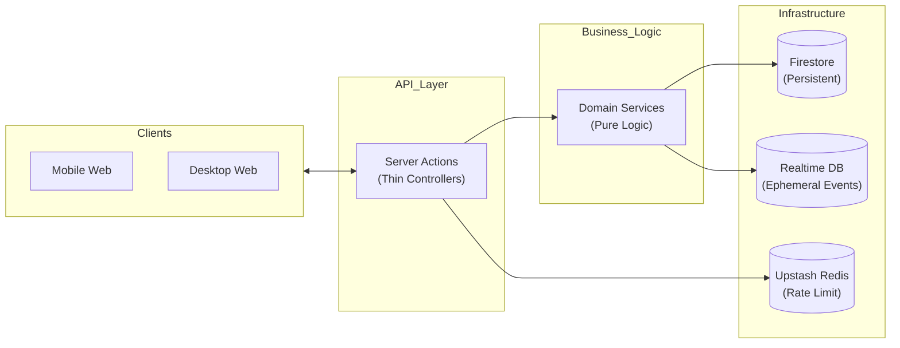
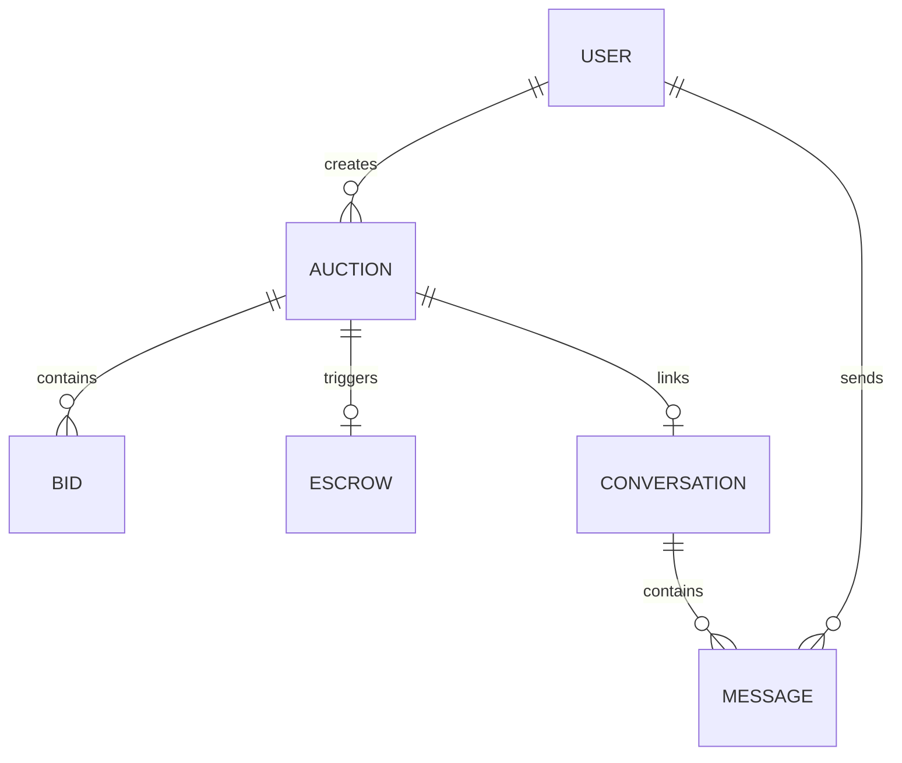

# Staff Engineer Guide

This guide is for senior technical leaders and staff engineers. It focuses on the architectural tradeoffs, complex data patterns, and non-obvious design decisions that sustain Nilamit's enterprise reliability.

## The Core Architectural Insight

Nilamit's "Secret Sauce" is its **Deterministic Bidding Transaction**. To prevent race conditions and shill bidding while ensuring high performance, we use a single-document lock pattern in Firestore.

### Pseudocode (Python Comparison)
If we were building this in a standard RDBMS like Postgres:
```python
# Postgres equivalent of our Firestore transaction
def place_bid(auction_id, user_id, amount):
    with db.transaction():
        # LOCK the auction row
        auction = db.execute("SELECT * FROM auctions WHERE id = %s FOR UPDATE", auction_id)
        
        # Validate business rules
        if amount <= auction.current_price:
            throw Error("Bid too low")
            
        # Update and save
        db.execute("UPDATE auctions SET current_price = %s, current_bidder_id = %s WHERE id = %s", 
                  amount, user_id, auction_id)
        
        # Emit real-time event (Side effect)
        redis.publish(f"auction:{auction_id}", {"price": amount})
```

In Nilamit, this is implemented in `src/services/bidding/bidding-service.ts` using Firestore `runTransaction`.

## System Architecture


<!-- Sources: src/actions/bid.ts, src/services/bidding/bidding-service.ts, src/lib/db.ts, src/lib/ratelimit.ts -->

## Design Tradeoffs

| Decision | Rationale | Tradeoff |
|----------|-----------|----------|
| **No Client Writes** | Security & Centralized Logic | Slight increase in latency (Action overhead) |
| **RTDB for Bids** | Firestore's cost/latency is too high for live ticker | Eventual consistency in extreme edge cases |
| **Fail-Closed Redis** | Security-first approach for production | Outage in Upstash results in 429 for all users |
| **Denormalized Prices** | Optimized for bid panel rendering | Must maintain consistency during updates |

## Domain Model ERD


<!-- Sources: src/types/user.ts, src/types/auction.ts, src/types/finance.ts -->

## Decision Log

### 1. Migration to Service-Layer Architecture (April 2026)
**Context**: Server Actions were growing to 1000+ lines, becoming difficult to test and reuse in cron jobs.
**Decision**: Extract business logic into `src/services/`.
**Impact**: Unit testing coverage increased by 40%, and `close-auctions` cron job now uses the same logic as manual admin closures.

### 2. Standardized `ServiceResponse<T>` (May 2026)
**Context**: UI components had inconsistent error handling.
**Decision**: Enforce a rigid response contract: `{ success: boolean, data?: T, error?: string }`.
**Impact**: Eliminated "Unhandled Runtime Exception" errors in the frontend.

## Related Pages

| Page | Relationship |
|------|-------------|
| [Architecture Overview](../architecture.md) | Base architectural documentation |
| [Contributor Guide](./contributor-guide.md) | Basic setup and foundations |
| [Executive Guide](./executive-guide.md) | Business and risk perspective |
