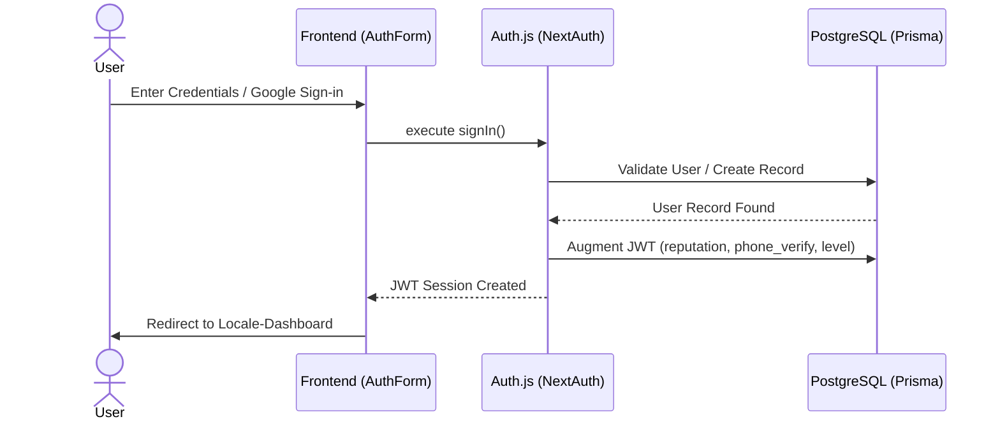
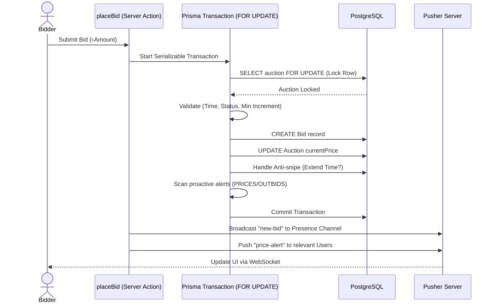
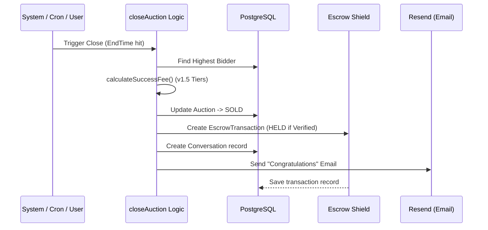
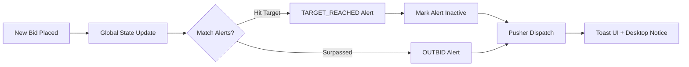

# Nilamit Behavioral Flows: The Logic Engine

This document visualizes the mission-critical workflows of the Nilamit platform, using sequence diagrams to map interactions between the Client, Server Actions, Database, and Real-time Bus.

---

## 🔐 1. Authentication & Identity Flow
*How users enter the platform and how their persona is established.*



---

## ⚡ 2. The Bidding Engine (High-Concurrency)
*The critical "Battle Flow" for securing an item.*



---

## 🏁 3. Auction Closing & Escrow Flow
*The "Liquidation" process once the clock hits zero.*



---

## 💬 4. Real-time Coordination Flow
*How buyer and seller coordinate post-sale safely.*

```mermaid
sequenceDiagram
    actor Buyer
    actor Seller
SA as chat.ts (Server Action)
    participant PII as PII Filter Utility
    participant DB as PostgreSQL
    participant PS as Pusher Server
    
    Buyer->>SA: Send Message + Image
    SA->>PII: checkContent() (Filter phone/critical info)
    PII-->>SA: Content Masked / Validated
    SA->>DB: SAVE Message (Conversation ID)
    SA->>PS: Trigger "NEW_MESSAGE" event
    PS-->>Seller: Real-time UI Update + Notification Sound
    Seller->>SA: Reply (Logistics Coordination)
```

---

## 🚨 5. Real-time Alert Flow (eBay Model)
*The proactive "Outbid" and "Target" system.*


