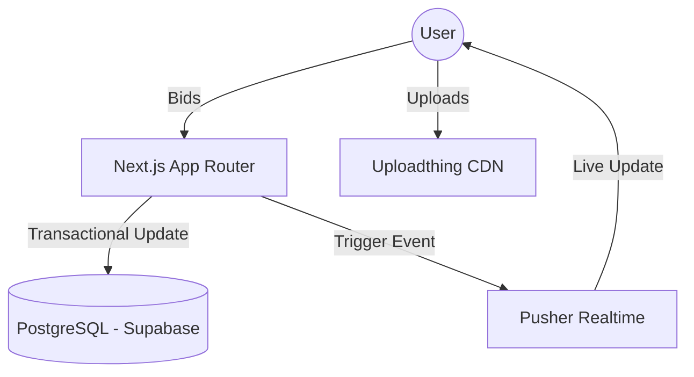

# 🏗️ Architecture: Nilamit System Design

## System Overview
Nilamit is a real-time, transaction-safe auction platform optimized for the Bangladeshi mobile web. It uses a **Push-First** model where price updates are broadcast to clients via WebSockets (transitioning from polling).

## Technical Stack
- **Framework**: Next.js 15 (App Router)
- **Database**: PostgreSQL (Supabase) via Prisma 7
- **Real-time**: Pusher (Event streaming for bid updates)
- **File Storage**: Uploadthing (CDN for auction images)
- **Auth**: NextAuth v5 (Hybrid) — Supports Phone OTP, Email/Password, and Google OAuth.
- **Verification**: Dedicated `VerificationGuard` component gating database mutations.

## Core Engine: Bidding
The bidding engine relies on **Row-Level Locking**. Every bid increment uses a Prisma transaction with a `SELECT FOR UPDATE` clause to prevent race conditions during high-volume auction closes.

## Topology (Mermaid)

## Data Entities
- **User**: Identified by phone or email. Verification status (phone/email) determines access levels via the Activity Gate.
- **Auction**: The primary unit of commerce. Features "Soft Close" anti-sniping logic.
- **Bid**: Historical log of all price increments.
- **Circle**: A social/geographic grouping mechanism for localized auctions.

## Social Mapping
The **StarMap** component (built with `d3-force`) visualizes trust relationships and proximity between nodes in the bidding network.
